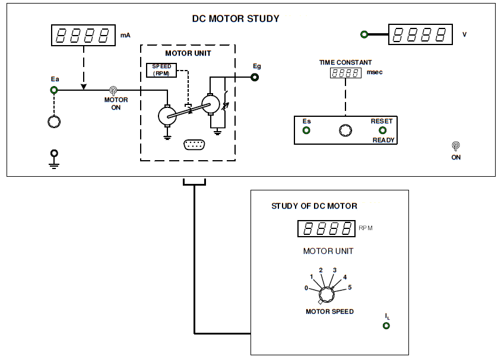

## Introduction

<b>Discipline | <b> Electrical Engineering 
:--|:--|
<b> Lab | <b> **Control and Instrumentation Lab**
<b> Experiment|     <b> **Study of DC Motor and Experiment 7**

### About the Experiment 
**System description**

D.C. motors are the most commonly used actuators in electro-mechanical control systems or servomechanisms. Compared to actuators like 2-phase a.c. motor and stepper motor, the d.c. motor has the advantage of higher torque and simpler driving circuit. However the presence of a commutator and a set of brushes with the problems of sparking make the d.c. motor somewhat less durable. This of course is not true for a present day well designed d.c. servomotor.
					
The study of the dynamic characteristics of the d.c. motor is important because the overall performance of the control system depends on it.A standard analysis procedure is to model the various subsystems and then combine these to develop the model of the overall system.

This experiment is designed to obtain the torque-speed characteristics, compute the various parameter and finally determine the transfer function of a d.c. motor.			  
			  

<figcaption style="color:blue">Fig1.Panel drawing DC Motor Study</figcaption>

<b>Name of Developer | <b> **Prof. Alok Kanti Deb**
:--|:--|
<b> Institute | <b>  **Indian Institute of Technology Kharagpur**
<b> Email id|     <b>  **alokkanti@ee.iitkgp.ac.in**
<b> Department |  **Department of Electrical Engineering**
<b>Webpage| <b> http://www.iitkgp.ac.in/department/EE/faculty/ee-alokkanti

### Contributors List

SrNo | Name | VLabs Developer or Integration Engineer | Designation | Department| Institute
:--|:--|:--|:--|:--|:--|
1 | **Piyali Chattopadhyay** | Developer & Integration | Project Scientist | Department of Electrical Engineering | IIT Kharagpur | 
