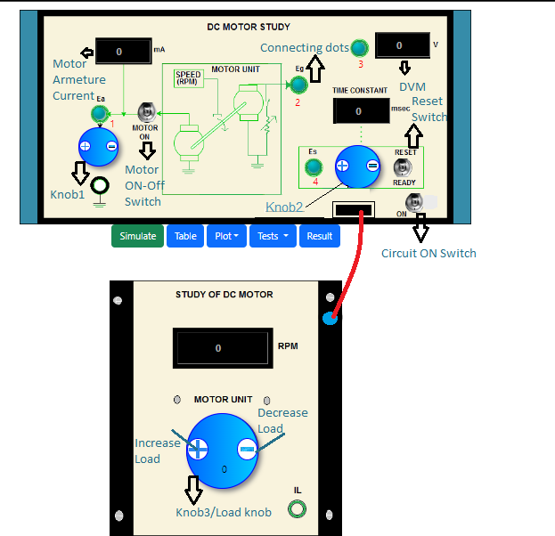

### Procedure
				
**Panel Drawing of the DC Motor Plant**

          

**Steps to perform the simulation**

<b style="color:blue">Motor and Generator Characteristics</b>

1. At first click on "Tests" button and click on 'No Load' to perform the DC Motor and Generator characteristics simulation.
  
2. Click on 'ON' button to switch on the circuit.Connect (blue dots for wire connection)1-3,click on 'MOTOR ON' button. Set ‘RESET’ switch to ‘RESET’. Set ‘LOAD’ to 0 position.
					 

          

					 
					 
3. Apply Ea through Knob1(start with 3v).Click on 'Simulate' button.Observe motor armature current(mA),Speed(rpm).Now click on the connected wire to delete that and connect 2-3 ,click on 'simulate'.Observe generated emf Eg

4. Click on 'Table' to take the observation data.Vary Ea in small steps and follow the above steps for Ea=3v to 12v.Click on 'Plot' then click on 'N Vs.Ea',again click on'Eg Vs. N'.Now click on 'Result' button to find Motor Constant,Generator Constant.Click on 'OK'.

5. Bring back all the knobs to initial position or zero value by clicking on 'minus' button on the knobs.Switch off the motor and circuit.						  
  
<b style="color:blue">Torque-Speed Characteristics</b>

1. At first click on "Tests" button and click on 'Load' to perform the DC Motor Torque-Speed characteristics simulation.
  
2. Click on 'ON' button to switch on the circuit.Connect 1-3,click on 'MOTOR ON' button. Set ‘RESET’ switch to ‘RESET’. Set ‘LOAD’ to 0 position. 
					 
3. Apply Ea through Knob1 and set Ea to 6v.Click on 'Simulate' button.Observe motor armature current(mA),Speed(rpm).Now click on the connected wire to delete that and connect 2-3 ,click on 'simulate'.Observe generated emf Eg

4. Click on 'Table' to take the observation data.Set the ‘LOAD’ to 1, 2, …5 through knob3 in the load box and take readings as above. Click on 'Plot' then click on'TM Vs. N'.Now click on 'Result' button to find Viscous Friction Coefficient B of Motor and Motor Back emf Constant Kb .Click on 'OK'.

5. Bring back all the knobs to initial position or zero value by clicking on 'minus' button on the knobs.
Follow the above steps for Ea=8v,10v and 12v.Switch off the motor and circuit. 
					
<b style="color:blue">Step Response of Motor</b>

1. At first click on "Tests" button and click on 'Step Response' to find the DC Motor Transfer Function.
  
2. Click on 'ON' button to switch on the circuit.Connect 1-3,click on 'MOTOR ON' button. Set ‘RESET’ switch to ‘RESET’. Set ‘LOAD’ to 0 position. 

3. Apply Ea through Knob1 and set Ea to 8v.Click on 'Simulate' button.Observe motor armature current(mA),Speed(rpm).Now click on the connected wire to delete that and connect 2-3 ,click on 'simulate'.Observe generated emf Eg
						
4. delete connection 2-3 and connect 4-3 ,click on 'Simulate' to see	Es value in DVM.Set Es to 63.2% of Eg measured above through knob2.
						
5. Switch ‘OFF’ the motor. Set ‘RESET’ switch to ‘READY’.Now switch the motor ‘ON’,click on 'Simulate' and observe the 'Time Constant'.
					
6. Click on 'Table' to take the observation data.Observe the Step Response.Now click on 'Result' button to
find Motor Inertia and Transfer Function.Click on 'OK'. 

7. Bring back all the knobs to initial position or zero value by clicking on 'minus' button on the knobs.Switch off the motor and circuit.Follow the above steps for Ea= 10v and 12v.