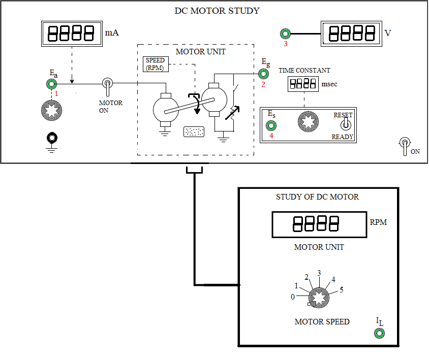
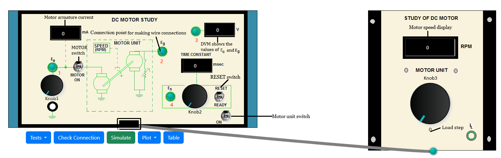

### Procedure

<b>Fig. 1. Panel drawing of the DC Motor plant</b>

<b>Steps to perform the simulation</b>

<ol>
<b style="color:blue;text-align:center">Motor and Generator Characteristics</b> 
<li>First click on "Tests" button (Fig. 2)  and click on 'No Load' to perform the experiment for finding the dc motor and generator characteristics.</li> 

<li><ul><li>Click on 'ON' button to switch on the motor unit. Connect (blue dots for wire connection) 1-3 (Fig. 2).</li>
<li><b>Note:</b> Example: connection point 1 - connection point 2 (drag the wire from connection point 1 by pressing left mouse button and release on connection point 2).</li>
<li>Click on 'Check Connection' button (Fig. 2).</li>
<li><b>Note:</b> Any wire connection can be deleted by clicking on the connected wire if required.</li>
<li>Set 'MOTOR' switch to 'ON' by clicking on it.</li>
<li> Set the 'RESET' switch to 'RESET'.</li>
<li>Set load to 0 value.</li></ul></li> 

<li><ul><li>Apply armature voltage Ea through rotating knob1 (start with 3 volts).</li>
<li><b>Note:</b> To rotate any knob put the mouse cursor on the knob handle (blue line on the knob), a hand symbol will be showing. Press left mouse button, rotate clockwise to increase or anticlockwise to decrease values.</li>
<li><b>Note:</b> If the desired value does not appear while rotating the knob in one attempt, try rotating it back and forth to reach the correct value. If the knob becomes unresponsive at any time, please refresh the page and repeat the experiment.</li>
<li>Click on 'Simulate' button (Fig. 2). Observe motor armature current (mA), speed (rpm).</li>
<li>Now click on the connected wire (1-3) to delete that and connect 2-3 (Fig. 2).</li>
<li>Click on 'Check Connection' button.</li>
<li>Click on 'Simulate' button. Observe generator voltage Eg.</li>
<li>Click on 'Table' button to get the observation table.</li></ul></li> 

 
<b>Fig. 2. DC Motor plant simulation model</b>

 						

<li>Delete connection 2-3 and again connect 1-3, click on 'Check Connection' button then on 'Simulate' button. Increase the armature voltage to 4 volts and follow
step 3.</li>  

<li><ul><li>Vary Ea from 5 - 12 volts and follow step 3.</li>
<li>Now Click on 'Plot' button, then on 'Speed (N) Vs. Motor armature voltage (Ea)'.</li> 
<li>From a slope of the plot calculate motor constant KM (rpm/volts) (calculation explained in theory).</li> 

<li>Again click on 'Generator voltage (Eg) Vs. Speed (N)' under plot button.</li>
<li>From a slope of this plot calculate generator constant KG (volts/rpm) (calculation explained in theory).</li> 

<li>Plots can be downloaded by clicking on 'Download Plot' button.</li>
<li>Now enter the values of KM and KG in the corresponding box under 'Result Block'.</li></ul></li> 

<li>Bring back all the knobs to zero value. Set 'MOTOR' switch to 'OFF' by clicking on it again and switch off the motor unit.</li>   
</ol>
<ol>
<b style="color:blue;text-align:center">Torque-Speed Characteristics</b> 
<li>First click on "Tests" button and click on 'Load' to perform the experiment for finding the dc motor torque-speed characteristics.</li> 

<li><ul><li>Click on 'ON' button to switch on the motor unit.</li>
<li>Connect 1-3, click on 'Check Connection' button. set 'MOTOR' switch to 'ON' by clicking on it.</li>
<li>Set the 'RESET' switch to 'RESET'. Set load to 0 value.</li></ul></li> 

<li><ul><li>Apply armature voltage Ea through knob1 and set Ea to 6 volts.</li>
<li>Click on 'Simulate' button. Observe motor armature current (mA), speed (rpm).</li>
<li>Now click on the connected wire (1-3) to delete that and connect 2-3 , click on 'Check Connection' button then on 'Simulate' button. Observe generator voltage Eg.</li>
<li>Click on 'Table' button to get the observation data.</li></ul></li> 

<li><ul><li>Set load to 1 through knob3. Delete connection 2-3 and again connect 1-3. Click on 'Check Connection' button.</li>
<li>Click on 'Simulate' button and follow step 3. Now vary the load from 2 to 5 through knob3 and take observations following step 3.</li> 
<li>Click on 'Check Connection' button then on 'Simulate' button each time after a wire connection is made.</li>
<li>Click on 'Plot' then click on 'Torque (TM) Vs. Speed (N)'.</li>
<li>Now from a slope of the plot calculate viscous friction coefficient B (newton-meter/rad/sec) of motor and calculate average value of motor back emf constant Kb
(volts/rad/sec) from the observation table.</li>
<li>Now enter the values of B and Kb in the corresponding box under 'Result Block'.</li></ul></li>  

<li><ul><li>Bring back all the knobs to zero value.</li>
<li>Follow steps 1-4 for Ea = 8, 10 and 12 volts.</li>
<li>Set 'MOTOR' switch to 'OFF' by clicking on it again and switch off the motor unit.</li></ul></li>   
</ol>
<ol>
<b style="color:blue;text-align:center">Step Response of Motor</b> 
<li>First click on "Tests" button and click on 'Step Response' to perform the experiment for finding the dc motor transfer function.</li> 

<li><ul><li>Click on 'ON' button to switch on the motor unit.</li>
<li>Connect 1-3, click on 'Check Connection' button, set 'MOTOR' switch to 'ON' by clicking on it.</li>
<li>Set the 'RESET' switch to 'RESET'. Set load to 0 value.</li></ul></li> 

<li><ul><li>Apply armature voltage Ea through knob1 and set Ea to 8 volts. Click on 'Simulate' button.</li>
<li>Observe motor armature current (mA), speed (rpm).</li>
<li>Now click on the connected wire (1-3) to delete that and connect 2-3 , click on 'Check Connection' button then on 'Simulate'.</li>
<li>Observe generator voltage Eg</li></ul></li> 

<li><ul><li>Now delete connection 2-3 and connect 4-3 , click on 'Check Connection' button then on 'Simulate' to observe Es value in DVM.</li>
<li>Set Es through knob2 to 63.2 &percnt; of Eg (measured above).</li></ul></li> 

<li><ul><li>Set 'MOTOR' switch to 'OFF'. Set 'RESET' switch to 'READY'.</li>
<li>Now set the 'MOTOR' switch to 'ON', click on 'Simulate' and observe the 'Time Constant (msec)'.</li></ul></li> 

<li><ul><li>Click on 'Table' to get the observation data. Observe the step response.</li>
<li>Now find the motor inertia J using the values of B, Kb (calculated before) and &tau;m from observation table following the formula provided in 'Result Block'.</li>
<li>Now enter the value of J in corresponding box under 'Result Block'.</li>
<li>Click on 'Show Transfer Function' button to get the transfer function of the motor.</li></ul></li>  

<li> Bring back all the knobs to zero value. Follow steps (1-6) for Ea= 10 and 12 volts. Set 'MOTOR' switch to 'OFF' and switch off the motor unit..
</li>   
</ol>
  
<link href="./simulation/css/DC.css" rel="stylesheet">

  
