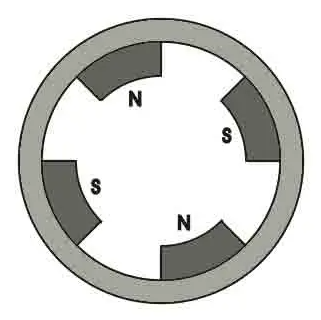
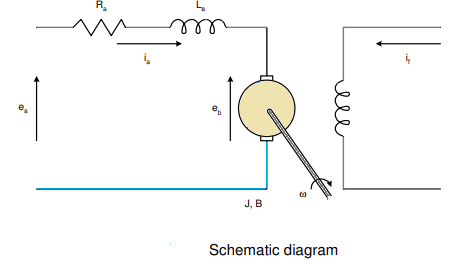
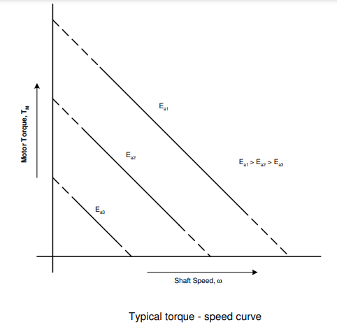
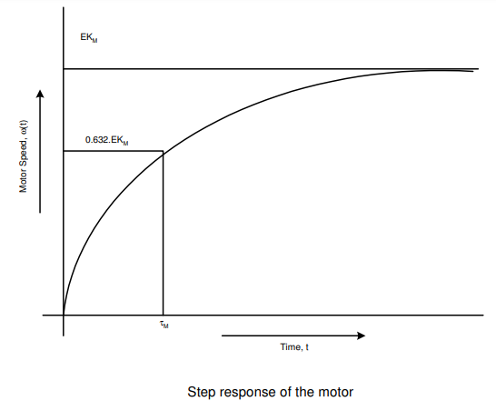

# Theory

 The first step in the analysis of control system is to derive its mathematical model to understand the working of the complete system.
			   
**The Plant(Coupled-DC Motor-Generator set):**

In a DC motor, an armature rotates inside a magnetic field.The basic working principle of a DC motor is based on the fact that whenever a current carrying conductor is placed inside a magnetic field, there will be mechanical force experienced by that conductor.All kinds of DC motors work under this principle. Hence for constructing a DC motor, it is essential to establish a magnetic field.The magnetic field is established by using a magnet. You can use different types of magnets – it may be an electromagnet or it can be a permanent magnet.A Permanent Magnet DC motor (PMDC motor) is a type of DC motor that uses a permanent magnet to create the magnetic field required for the operation of a DC motor.	

				

				
**Mechanical Section:**

It comprises of the experimental permanent magnet d.c. motor(approx. 8W) coupled to a small d.c. generator (approx. 2W), which serves the twin purposes of,
				
1. Electrical loading of the motor

2. Transient response signal pick-up.
				
Further, a slotted disk mounted on the common shaft produces 6 pulses per revolution through an opto- interrupter, which is used in a 4-digit speed display in r.p.m.The specifications of the main experimental d.c. motor are:
				
• Operating Voltage :12Vdc

• No Load Current: 0.09A

• Full Load Current: 1.0A

• Torque: 30mN-m/ 300g-cm

**Permanent Magnet DC motor (PMDC motor):**

The field poles of this motor are essentially made of permanent magnet.A PMDC motor mainly consists of two parts.A stator and an armature. Here the stator which is a steel cylinder. The magnets are mounted in the inner periphery of this cylinder.The permanent magnets are mounted in such a way that the N-pole and S-pole of each magnet are alternatively faced towards armature as shown in the figure below.
				

				

				
				
**Working Principle:**

The working principle of PMDC motor is just similar to the general working principle of DC motor.That is when a carrying conductor comes inside a magnetic field, a mechanical force will be experienced by the conductor and
the direction of this force is governed by Fleming’s left hand rule.As in a permanent magnet DC motor, the armature is placed inside the magnetic field of a permanent magnet,the armature rotates in the direction of the generated force.Here each conductor of the armature experiences the mechanical force F = B.I.L Newton where, B is the magnetic field strength in Tesla (weber / m2),I is the current in Ampere flowing through that conductor and L is the length of the conductor in meter comes under the magnetic field.Each conductor of the armature experiences a force and the compilation of those forces produces a torque, which tends to rotate the armature.
				

				

				
**D.C. Motor Model**
				
The schematic diagram of a d.c. motor is shown in above figure wherein the following notations are used

ea : Armature voltage (volts)
ia : Armature current (amp.)
Ra : Armature resistance (ohms)
La : Armature inductance (henry)
eb : Back emf (volts)
if : Field current (amp.)
TM : Motor torque (newton-m)
TL : Load torque (newton-m)
&omega; : Angular velocity (rad/sec)
J : Moment of inertia of the rotor including external loading if any (newton-m/rad/sec2)
B : Viscous friction coefficient including external loading if any (newton-m/rad/sec)
KT : Torque constant
Kb : Back emf constant				
				
Upper case notations Ea, Ia, Eb, Ifare used for steady state values of the respective variables ea, ia, eb and if				
				
In the present set-up a permanent magnet d.c. motor is used, the field winding is thus absent and the air gap flux is constant.The input drive may therefore be applied to the armature only, that is, only armature controlled operation is possible.

The mathematical equations in this operating mode are, 
				
$$T_M = K_T I_a$$
				
$$e_b = K_b \omega$$
				
Armature circuit model
				
$$L_a\frac{di_a}{dt} + R_a i_a + e_b = e_a$$
				
Mechanical model
				
$$J\frac{d\omega}{dt} + B\omega + T_L = T_M $$
				
Taking Laplace Transform and rearranging the terms,
				
$$\frac{\omega(s)}{E_a(s)} = \frac{K_T}{(sL_a + R_a)(sJ + B) + K_T K_b}$$
				
Assuming the inductance of the armature circuit to be very small, the motor transfer function may be written as, 
				
$$G_M(s) = \frac{\omega(s)}{E_a(s)} = \frac{K_T/R_a}{Js + B + \frac{K_T K_b}{R_a}} = \frac{K_M}{s\tau_m + 1}$$
				
Motor Gain Constant(KM)
				
$$K_M = \frac{K_T}{R_a B + K_T K_b}$$
				
Motor Time Constant
				
$$\tau_m = \frac{R_a J}{R_a B + K_T K_b}$$
				
				
The armature controlled motor therefore has a first order type-0 transfer function and the two constant KM and &tau;mdepend upon motor parameters.
				
**Torque – Speed Curves**
				
As a mechanical actuator the magnitude of the steady state torque produced by the motor with a given armature voltage is of interest to an user. With a simple rearrangement of terms the motor torque may be written as,
				
steady state armature current
				
$$I_a = \frac{E_a-E_b}{R_a} = \frac{E_a}{R_a} - \frac{K_b \omega}{R_a}$$
				
steady state torque generated 
				
$$T_M = K_T I_a = \frac{-K_T K_b}{R_a}\omega + \frac{K_T}{R_a}E_a$$
				
Here TM, Ea, Eb, Ia and &omega; are the steady state values of the motor torque, applied armature voltage, back emf, armature current and angular velocity of the shaft.
A typical plot of the above equation is shown in Fig below. This assumes a linear torque-speed behaviour
								
As the motor runs at constant speed,Electrical power input, Pin = Ea x Ia watts Power lost in

 Ra = Ra x Ia x Ia

Power available in the armature,

Parm = (Ea – Ia Ra) Ia= Eb x Ia

= Kb x &omega; x Ia
				
Mechanical power developed,
				
$$P_mech = T_M \omega = K_T I_a \omega$$
				
Assuming 100% conversion of power from electrical input to mechanical output, the above two expressions can be equated to get
				
$$K_b(\frac{volts}{rad/s}) = K_T(\frac{N-m}{amp})$$
				
$$T_M = \frac{-K_b^2}{R_a}\omega + \frac{K_b}{R_a}E_a$$
				
When the motor is loaded, the speed decreases which reduces the back emf. This increases armature current ia so that the motor develops more torque in order to supply the load.
				
At steady state (&omega; = constant) the load torque equation must read as 
				
$$T_M = B_\omega + T_L$$

TL : load torque
				
In the experimental work TL is increased in steps by loading the motor with the help of	the coupled generator and the values of TM and &omega; are recorded. While &omega; is computed from the speed N, in rpm, as displayed on the motor unit,the following expression is used to compute	the motor torque TM at a constant value of Ea,

$$T_M = K_T I_a = K_b I_a = \frac{E_b}{\omega} I_a = \frac{E_a - I_a R_a}{\omega}$$
				

				

				
Two motor parameters, B and Kb, may therefore be determined from the Torque-Speed Characteristics obtained under steady state conditions or constant speed operation of the motor 
				
**Transient Response**
				
In response to a step input,
				
$$e_a(t) = E U(t), E_a(s) = \frac{1}{s}$$
				
the motor speed will follow the expression,
				
$$\omega(t)= E K_M (1- e^\frac{-t}{\tau_m})$$

The step response is very similar to that of an RC circuit charging from a step voltage input.The parameters of interest EKM and &tau;m are indicated in Fig below. One can easily measure the steady state speed, N, and hence compute KM
				
$$K_M = \frac{N}{E}(rpm/volt) = \frac{\pi N}{30 E_a}$$
				
Measurement of &tau;m: the time taken by the motor speed to rise from zero and attain63.2% of ωss,
				

				

						
								