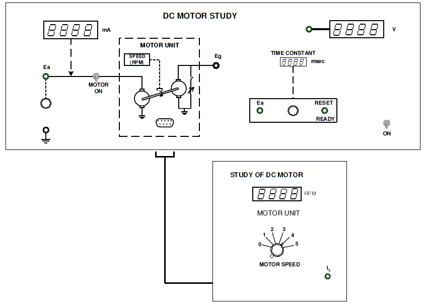
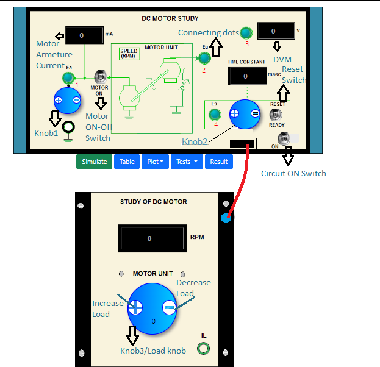

### Procedure
				
**Panel Drawing of the DC Motor Plant**

           

								
								
**Steps to perform the simulation**

								
<b style="color:blue;text-align:center">Motor and Generator Characteristics</b>

1. At first click on "Tests" button and click on 'No Load' to perform the DC Motor and Generator characteristics simulation.
  
2. Click on 'ON' button (toggle switch) to switch on the circuit. Connect (blue dots for wire connection) 1-3, click on 'MOTOR ON' toggle switch. Set ‘RESET’ switch to ‘RESET’. Set ‘LOAD’ to 0 position. </li> 
					 
3. Apply armature voltage Ea through knob1 (start with 3v). Click on 'Simulate' button. Observe motor armature current(mA), speed(rpm). Now click on the connected wire to delete that and connect 2-3 , click on 'simulate' . Observe generated emf Eg.
						

           

	
						
4. Click on 'Table' to tabulate the observation data. Vary Ea in small steps (Ea = 3v to 12v) and follow the step 3. Click on 'Plot' then click on 'N Vs. Ea', again click on'Eg Vs. N'. Now click on 'Result' button to find Motor Constant, Generator Constant. Click on 'OK'. 

5. Bring back all the knobs to initial position or zero value by clicking on 'minus' button on the knobs. Switch off the motor and circuit by clicking on respective toggle switches.

<b style="color:blue;text-align:center">Torque-Speed Characteristics</b>

1. At first click on "Tests" button and click on 'Load' to perform the DC Motor Torque-Speed characteristics simulation.
  
2. Click on 'ON' button (toggle switch) to switch on the circuit. Connect 1-3, click on 'MOTOR ON' toggle switch. Set ‘RESET’ switch to ‘RESET’. Set ‘LOAD’ to 0 position. 
					 
3. Apply armature voltage Ea through knob1 and set Ea to 6v. Click on 'Simulate' button. Observe motor armature current(mA), speed(rpm). Now click on the
connected wire to delete that and connect 2-3 , click on 'Simulate'. Observe generated emf Eg.Click on 'Table' to tabulate the observation data.
						
4.  Set the ‘LOAD’ to 1 through knob3 in the load box. Delete connection 2-3, connect 1-3. Click on 'Simulate' button. Observe motor armature current(mA), speed(rpm). Again delete connection 1-3 and connect 2-3, click on 'Simulate' to observe the generated emf Eg.Click on 'Table' to tabulate the observation data.	

5. Vary the ‘LOAD’ from 2-5 through knob3 in the load box and take observations following step 4 . Click on 'Plot' then click on 'TM Vs. N' to observe the torque vs. speed plot. Now click on 'Result' button to find Viscous Friction Coefficient B of Motor and Motor Back emf Constant Kb .Click on 'OK'. 

6. Bring back all the knobs to initial position or zero value by clicking on 'minus' button on the knobs. Follow the steps (3-5) for Ea= 8v,10v and 12v. Switch off the motor and circuit by clicking on respective toggle switches.

<b style="color:blue;text-align:center">Step Response of Motor</b>

1. At first click on "Tests" button and click on 'Step Response' to perform the experiment for finding the DC Motor Transfer Function.
  
2. Click on 'ON' button (toggle switch) to switch on the circuit. Connect 1-3, click on 'MOTOR ON' toggle switch. Set ‘RESET’ switch to ‘RESET’. Set ‘LOAD’ to 0 position.  
					 
3. Apply armature voltage Ea through knob1 and set Ea to 8v. Click on 'Simulate' button. Observe motor armature current(mA), speed(rpm). Now click on the connected wire to delete that and connect 2-3 , click on 'Simulate' button. Observe generated emf Eg. Note down the value.
						
4. Now delete connection 2-3 and connect 4-3 , click on 'Simulate' button to see Es value in DVM. Set Es to 63.2% of Eg (measured in step 3) through knob2.
						
5. Switch ‘OFF’ the motor. Set ‘RESET’ switch to ‘READY’. Now switch on the motor, click on 'Simulate' and observe the 'Time Constant'.
					
6. Click on 'Table' to tabulate the observation data. Observe the Step Response. Now click on 'Result' button to find Motor Inertia and Transfer Function. Click on 'OK'.

7. Bring back all the knobs to initial position or zero value by clicking on 'minus' button on the knobs. Switch off the motor and circuit by clicking on respective toggle switches.
Follow the steps (3-6) for Ea = 10v and 12v.
					